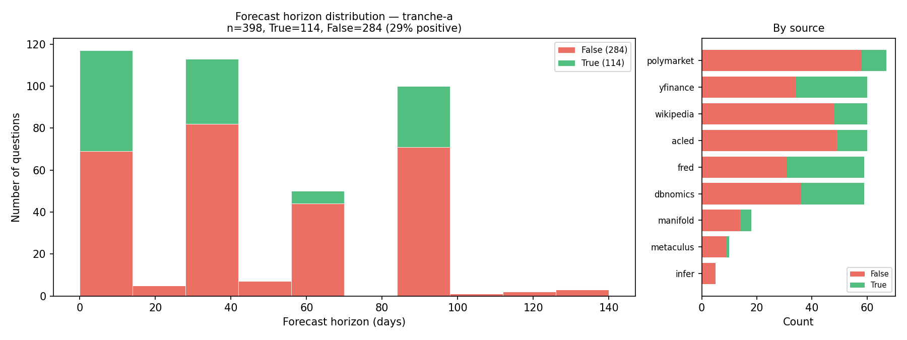
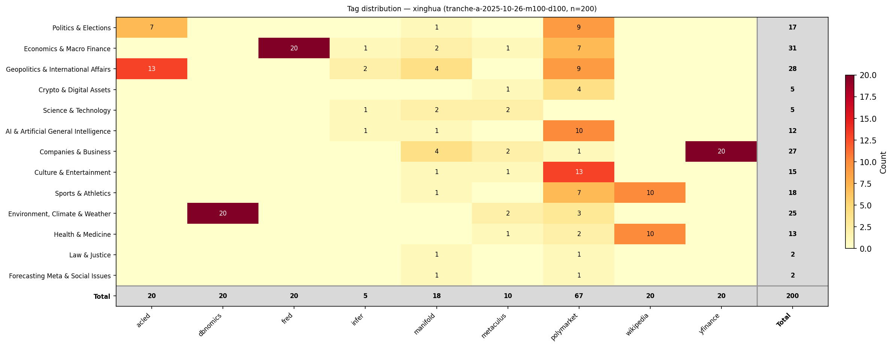
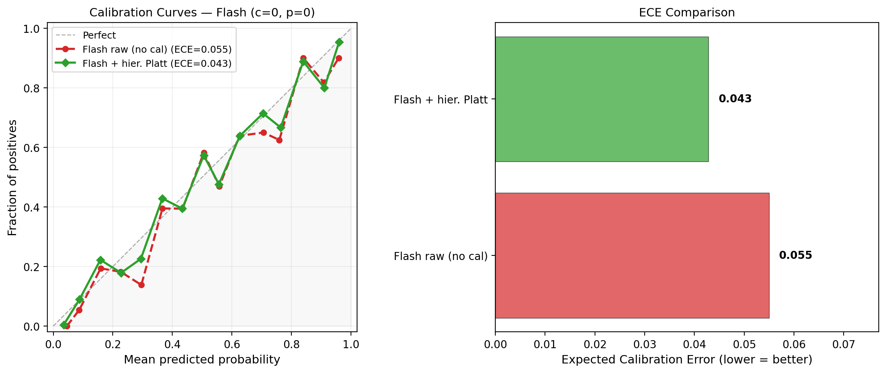
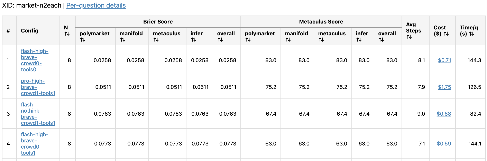
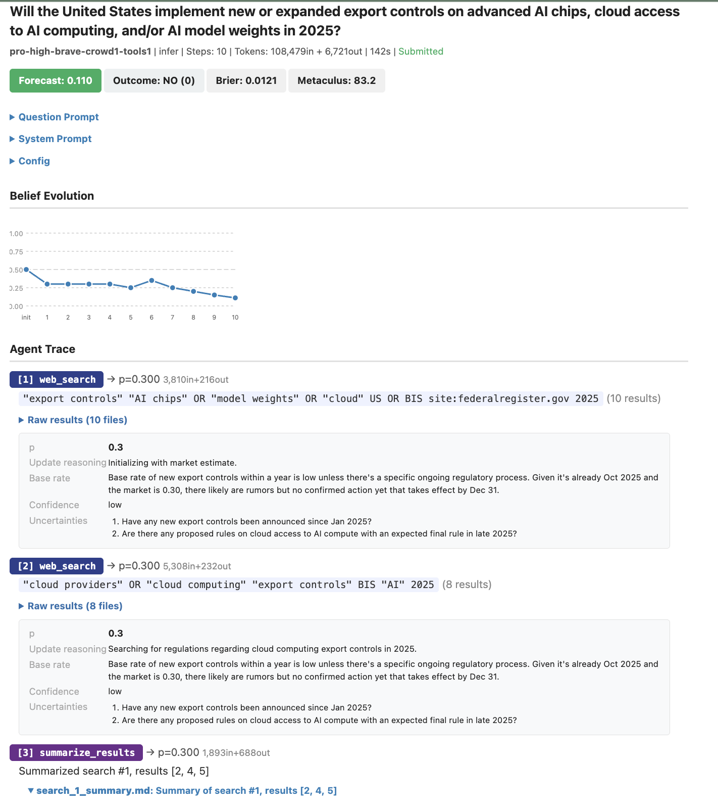

# Forecasting Workflow (v6)

End-to-end pipeline for the agentic forecaster.
Supports backtesting on
[AIBQ2](https://thinkingmachines.ai/news/training-llms-to-predict-world-events/#datasets)
(aka Q2 2025 Metaculus AI Benchmark Tournament test set of 113 questions),
[ForecastBench](https://www.forecastbench.org/) (market and dataset questions),
and live competition submission.

---

# Setup

## API keys

Copy `.env.example` to `.env` and fill in your keys:

```bash
cp .env.example .env
# Edit .env with your API keys
```

**Required keys:**

| Key | Purpose | Where to get it |
|---|---|---|
| `OPENROUTER_API_KEY` | All LLM calls (via litellm) | [openrouter.ai/keys](https://openrouter.ai/keys) |
| `BRAVE_API_KEY` | Web search (default engine) | [brave.com/search/api](https://brave.com/search/api/) |

**Optional keys:**

| Key | Purpose |
|---|---|
| `FRED_API_KEY` | FRED economic data tool |
| `SERPER_API_KEY` | Alternative search engine |
| `GOOGLE_API_KEY` | Alternative search engine |
| `EXA_API_KEY` | Alternative search engine |

Keys are loaded automatically from `.env` via `python-dotenv`.
You can also set them as shell environment variables:

```bash
export OPENROUTER_API_KEY=sk-or-v1-...
export BRAVE_API_KEY=...
python3 src/core/predict.py --xid my-xid --ntrials 1 --verbose
```

**macOS SSL fix:** If you get SSL certificate errors, add to `.env`:
```
SSL_CERT_FILE=/path/to/cacert.pem
```
Find the path with: `python3 -c "import certifi; print(certifi.where())"`

---

# Smoke tests

Two prebuilt smoke xids let you verify the install (API keys, dotenv
loading, question data, agent loop, eval pipeline) before running a real
experiment. Both use `flash` at `thk:high, crowd:1, tools:1` — fast, cheap,
and exercise the full predict → eval path.

## `xid-smoke-aibq2-n2` — minimal (2 questions)

Two AIBQ2 questions. Fastest end-to-end check; finishes in 1–2 minutes.

```bash
python3 src/core/predict.py --xid xid-smoke-aibq2-n2 --verbose
python3 src/core/eval.py --xid xid-smoke-aibq2-n2
open experiments/eval/xid-smoke-aibq2-n2/leaderboard.html
```

Use when: first-time setup verification, or after a change that could
break basic agent-loop mechanics (prompt formatting, tool dispatch,
forecast file I/O).

## `xid-smoke-tranche-a-n1each` — per-source coverage (9 questions)

One question from each of the 9 ForecastBench sources: `acled`,
`dbnomics`, `fred`, `infer`, `manifold`, `metaculus`, `polymarket`,
`wikipedia`, `yfinance`. Exam built from
`data/exams/tranche-a-n1each/mixture.json` with `select: {<source>: 1}`
for each (uses the same `seed=42` as `tranche-a`, so picks the first
question per source after shuffling).

```bash
python3 src/core/predict.py --xid xid-smoke-tranche-a-n1each --verbose
python3 src/core/eval.py --xid xid-smoke-tranche-a-n1each
open experiments/eval/xid-smoke-tranche-a-n1each/leaderboard.html
```

Wall time: ~3 minutes with 50 parallel workers (default) — limited by the
slowest question.

Use when: you've changed anything source-specific (the per-source tool
set in `config.py`, the meta-controller, data-fetching tools for
`yfinance`/`fred`/`dbnomics`, or prompt scaffolding that differs by
`Qsource`/`FBQtype`). Covers every tool path in a single run.

---

# Pipeline

## 1. Download data

**AIBQ2:**
```bash
python3 src/data/aibq2_make_data.py          # skip existing
python3 src/data/aibq2_make_data.py --force  # overwrite all
```

**ForecastBench** (resolved questions for backtesting):
```bash
python3 src/data/fb_make_data.py --start-date 2025-10-26 --end-date 2026-03-31
python3 src/data/fb_make_data.py --github-url https://github.com/.../resolution_set.json --exam my-exam
```

Sources: `polymarket`, `manifold`, `metaculus`, `infer` (markets) and
`acled`, `dbnomics`, `fred`, `wikipedia`, `yfinance` (datasets).

All questions are written to `data/questions/{source}/{id}.json`.

## 2. Tag questions (optional)

Classify questions into categories for analysis in eval plots:

```bash
python3 src/data/classify_questions.py --version kevin     # just kevin's categories
python3 src/data/classify_questions.py --version all    # all label types
python3 src/data/classify_questions.py --source aibq2    # specific sources
```

Tags are written to `data/tags_{version}/{source}/{id}.json`.

In addition to LLM-classified tags, the system supports **virtual tag spaces**
derived from question metadata (see `src/config/tags.py`):

| Tag space | Values | Use |
|---|---|---|
| `Qsource` | polymarket, fred, etc. | Per-source analysis |
| `FBQtype` | market, dataset | ForecastBench-style grouping |
| `Qtype` | timeseries, wikipedia, acled, market | Policy dispatch |
| `Atype` | binary-single, binary-multi | Answer format |
| `xinghua` | 15 LLM-classified categories | Fine-grained topic analysis |
| `ben` | 9 LLM-classified categories | Coarser topic analysis |

## 3. Create exams {#create-exams}

An exam is a named view of questions defined by `data/exams/{name}/mixture.json`.
Running `make_exam.py` materializes it into `indices.json`, `meta.json`, and
data visualization plots.

### Mixture fields

| Field | Description | Default |
|---|---|---|
| `ask-start` | Only include questions with `forecast_due_date >= value` | `1900-01-01` |
| `ask-end` | Only include questions with `forecast_due_date <= value` | `2999-12-31` |
| `resolution-start` | Only include questions resolved on or after this date | *(no filter)* |
| `resolution-end` | Only include questions resolved on or before this date | *(no filter)* |
| `seed` | Random seed for shuffling (`null` = alphabetical, integer = deterministic) | `0` |
| `select` | Dict of `{source: N}` where N is count, `[offset, count]`, or `"all"` | all sources |

### Select syntax

| Value | Meaning |
|---|---|
| `N` | First N questions (after shuffling) |
| `"all"` | All questions matching date filters |
| `[offset, count]` | Skip `offset`, take `count` (for train/test splits) |

### Safety filtering (backtesting) {#safety-filtering}

Set `ask-start` to a date well after the LLM's knowledge cutoff to prevent
parametric knowledge leakage. Set `resolution-end` to ensure ground truth.

| Start date | Safe for |
|---|---|
| `2025-03-02` | Gemini (cutoff 2025-01-31) |
| `2025-10-26` | All models (cutoff ≤ 2025-08-31) |

### Examples {#exam-examples}

**AIBQ2** — all 113 questions, alphabetical order (`data/exams/aibq2-all/mixture.json`):
```json
{ "seed": null, "select": { "aibq2": "all" } }
```

**Tranche A** — single forecast date, 100 market + 100 dataset (`data/exams/tranche-a/mixture.json`):
```json
{
    "ask-start": "2025-10-26",
    "ask-end": "2025-10-26",
    "resolution-end": "2026-04-10",
    "seed": 42,
    "select": {
        "infer": "all", "manifold": "all", "metaculus": "all", "polymarket": "all",
        "acled": 20, "dbnomics": 20, "fred": 20, "wikipedia": 20, "yfinance": 20
    }
}
```

### Build {#build-exams}

```bash
python3 src/data/make_exam.py --name aibq2-all
python3 src/data/make_exam.py --name tranche-a
```

`make_exam.py` generates `indices.json`, `meta.json`, and data visualizations.
To regenerate the plots separately (e.g., after adding tags), use:

```bash
python3 src/data/plot_exams.py --name aibq2-all
python3 src/data/plot_exams.py --name tranche-a1 --name tranche-b1
```

The following plots are produced:

**Forecast horizon histogram** (`horizon_histogram.png`):
Shows the distribution of forecast horizons (resolution date minus forecast
date, in days), colored by outcome. The right panel shows the per-source
question count with outcome balance.



*Example: tranche-a (n=200 questions, 398 resolution dates). Most questions
resolve within 2 weeks or ~3 months. Dataset sources are balanced; market
sources skew negative (29% positive overall).*

**Resolution date vs forecast date scatter** (`rdate_by_fdate_scatter.png`):
Shows the forecast horizon as a 2D scatter (useful for multi-date exams).
Points above the diagonal have longer horizons. Color indicates outcome.

**Source × category heatmap** (`tag_{version}_distribution.png`):
Shows how questions are distributed across sources and categories.
Requires LLM-classified tags (run `classify_questions.py` first).



*Example: tranche-a. Polymarket dominates AI/crypto; manifold is more diverse.*

## 4. Configure the agent {#configure-agent}

Configs are specified as **delta strings** relative to a default template,
not as JSON files. The delta format uses `/` to separate fields:

```
flash/thk:high/crowd:1/tools:0
pro/thk:med/search:none/crowd:0
```

| Delta key | Config field | Short values | Description |
|---|---|---|---|
| (bare) | `llm` | flash, pro, sonnet, opus, grok4, ... | LLM model |
| `thk` | `reasoning_effort` | none, low, med, high | Thinking budget |
| `search` | `search_engine` | brave, serper, pplx, none | Web search provider |
| `crowd` | `show_crowd` | 0, 1 | Include crowd/market estimate in prompt |
| `tools` | `use_tools` | 0, 1 | Enable source-specific data tools |
| `steps` | `max_steps` | integer | Max agent loop iterations |
| `timeout` | `question_timeout` | integer | Seconds before forced submit |

**`show_crowd`**: When 1, the question prompt includes the market price or
crowd estimate (if available in the question data). For market sources this
is the prediction market probability; for dataset sources it's the most recent
known value of the time series. When 0, this information is hidden.

**`use_tools`**: When 1, source-specific data-fetching tools are available
to the agent alongside web search. When 0, only web search + URL lookup are
available. All tool queries are date-filtered: the `end_date` parameter is
clamped to the knowledge cutoff (= forecast_due_date) to prevent data leakage.
The start date (how far back to fetch) depends on the source.

| Source | Tool | Description |
|---|---|---|
| yfinance | `fetch_ts_yfinance` | Historical stock prices (1 year of daily data) |
| fred | `fetch_ts_fred` | FRED economic data series (full history) |
| dbnomics | `fetch_ts_dbnomics` | DBnomics time series (full history) |
| wikipedia | `fetch_wikipedia_toc`, `fetch_wikipedia_section` | Wikipedia page as of cutoff date |
| polymarket | `fetch_polymarket_info` | Market probability history (up to 90 days) |
| manifold | `fetch_manifold_info` | Market probability history (up to 90 days) |
| metaculus, infer, acled, aibq2 | *(none)* | Web search only |

The default config (`DEFAULT_CONFIG` in `src/config/config.py`) uses:
flash, high thinking, brave search, crowd=1, tools=1, max_steps=10,
timeout=300, agg_method=std-shrinkage.

Legacy config JSON files in `experiments/configs/` are still supported.

### Question-specific policy {#qtype-policy}

The agent adapts its behavior (policy) per question depending on the
question's `Qtype` (determined by `src/config/tags.py`). The Qtype affects the
prompt (source-specific tool hints) and available tools.
The agent ultimately decides which tools to call —
it could call only web_search, only source tools, or a mix. All Qtypes
have access to web search (unless `search_engine="none"`).

| Qtype | Sources | Source tools |
|---|---|---|
| `timeseries` | yfinance, fred, dbnomics | fetch_ts_* (combo tool: history + model estimate) |
| `wikipedia` | wikipedia | fetch_wikipedia_toc, fetch_wikipedia_section |
| `acled` | acled | *(none — web search only)* |
| `market` | polymarket, manifold, metaculus, infer | fetch_market_history (polymarket, manifold) |

> **Note**: Per-Qtype `max_steps` and `ntrials` overrides are defined in
> `_QTYPE_MAX_STEPS` and `_QTYPE_NTRIALS` in `predict.py`, but are
> **currently disabled** (commented out) for fair ablation comparison.
> All questions use the same `max_steps` and `ntrials` from the config.
> DBnomics is the one exception: it bypasses the LLM entirely and uses
> the KNN harmonic model directly (`_dbnomics_harmonic_forecast`).

### Multi-resolution dates {#multi-resolution}

For dataset questions with multiple resolution dates (e.g. "will this value
increase by date X, Y, Z?"), the agent submits a list of probabilities —
one per resolution date — with increasing uncertainty for more distant dates.
The prompt instructs:

```
## Resolution dates
2025-11-02, 2025-11-25, 2026-01-24

You must submit **3 probabilities** (one per resolution date) when you call submit.
Your uncertainty should INCREASE with forecast horizon.
```

### Prompt examples {#prompt-examples}

The system prompt is the same for all question types. It instructs the agent
to work in a tool-use loop: gather evidence, update beliefs, then submit.

The question prompt varies based on config flags. Key differences:

**`crowd=1` vs `crowd=0`** — with crowd=1, the prompt includes:
```
## Market estimate
The market probability on 2025-12-07 was 0.45.
```

**`tools=1`** — the prompt adds source-specific hints:
```
For this question, you MUST call `fetch_ts_yfinance` as your FIRST action
to retrieve the stock's price history. The tool output includes a statistical
trend analysis with P(increase) — use this as your PRIMARY probability anchor.
```

### Prompt inspection {#prompt-inspect}

Inspect the exact prompts that will be sent to the LLM for a given xid
or question:

```bash
# All configs × one question per source
python3 src/misc/show_prompts.py --xid xid-tranche-a1
open experiments/generated_prompts/xid-tranche-a1.html

# All prompt variants for a specific question
python3 src/misc/show_prompts.py --source polymarket --id 0x310c3d... --fdd 2025-10-26
open experiments/generated_prompts/polymarket_0x310c3d....html
```

The XID mode shows each config as a collapsible section with system prompt
and per-source question prompts. Source-specific differences (tool lists)
are highlighted. The question mode sweeps over crowd, tools, search,
nobelief, and live/backtest.

### Prompt verification {#prompt-test}

After changing configs or prompts, verify that system and question prompts
are consistent with config settings (tools match schema, crowd info
present iff `show_crowd=1`, belief state instructions match `nobelief`, etc.):

```bash
python3 src/testing/test_prompts.py --exam smoke2           # quick check (9 sources)
python3 src/testing/test_prompts.py --exam smoke2 --verbose  # show each check
```

This tests all 11 ablation configs (A–J) × all available sources,
checking 7 categories of invariants per combination.

## 5. Create experiment (xid) {#create-xid}

An xid ties together an exam, configs, metrics, and groupings.
Create as `experiments/xids/{name}.json`.

| Field | Description |
|---|---|
| `exam` | Exam name (required) |
| `config` | List of config names (hyphenated directory names) |
| `metrics` | List of metrics (default: `["brier-index", "adjusted-brier-index", "metaculus-score"]`) |
| `groups` | List of tag spaces for grouping (default: `["FBQtype"]`) |
| `manual_reference` | List of hard-coded reference scores to display on leaderboard/plots (e.g. `["sota", "benrich"]`). Point estimates only — defined in `eval.py:REFERENCE_SCORES`. |
| `fb_reference` | List of ForecastBench method keys to auto-import and include in eval (e.g. `["external.Google DeepMind.2"]`). Use `fb_leaderboard.py --xid ...` to discover available method keys. Data is cached locally; delete `data/fb_cache/forecastbench-processed-forecast-sets/` to refresh. |

**`groups`** controls two things:
1. **Plots**: For each tag space in the list, eval generates a composite bar
   chart showing per-tag-value metric scores (e.g. grouping by `FBQtype` shows
   market vs dataset; by `Qsource` shows per-source breakdown).
2. **Leaderboard columns**: The first tag space determines the leaderboard
   columns. Each unique tag value becomes a column, plus an "overall" column
   that averages across the displayed groups (equal-weighted).

**`reference`** adds external baseline scores (from `REFERENCE_SCORES` in
`eval.py`) to the leaderboard and metric plots. Available references:
`sota`, `superhuman` (ForecastBench leaderboard), `benrich` (Gemini 3.0
RiftRunner). References are matched by exam name prefix and metric.

Optional overrides: `plot_groups`, `leaderboard_groups` (if you want
different groupings for plots vs leaderboard).

```json
{
    "exam": "tranche-a",
    "config": ["flash-high-brave-c1-t0", "pro-high-brave-c1-t0"],
    "metrics": ["brier-index", "metaculus-score"],
    "groups": ["FBQtype", "Qsource"],
    "manual_reference": ["sota"]
}
```

## 6. Run experiment (predict) {#predict}

```bash
caffeinate -s python3 src/core/predict.py --xid my-xid --ntrials 5 --verbose --monitor
caffeinate -s python3 src/core/predict.py --xid my-xid --ntrials 1 --verbose
```

Per-trial results: `experiments/forecasts/{config}/trial_{t}/{source}/{id}.json`.
Aggregated forecasts: `experiments/forecasts/{config}/{source}/{id}.json`.

When `ntrials > 1`, each trial runs the agent independently, then the trials
are aggregated into a single forecast using the method specified by
`config.agg_method` (default: `"std-shrinkage"`). The aggregation uses
logit-space James-Stein shrinkage: when trials disagree (high cross-trial
std), the forecast is pulled toward 0.5. With `"plain-mean"`, the forecast
is the simple average. See `docs/shrinkage.tex` for the derivation.

### Aggregation variants (optional) {#aggregation}

Pre-compute lightweight aggregation variants for comparison in eval:

```bash
python3 src/core/aggregate.py --xid my-xid
python3 src/core/aggregate.py --xid my-xid --variants "mean:1,mean:5,shrink:5"
```

This creates variants like `mean:1` (expected single-trial score),
`mean:5` (average of 5 trials), `shrink:5` (shrinkage over 5 trials),
stored inside each forecast file's `trial_stats.aggregations` field.

To evaluate specific variants, list them in the xid's `config` field using
bracket notation: `"config[mean:1]"`, `"config[shrink:5]"`.

For LLM-based aggregation (an "Agentic Supervisor" that reads all trial
outputs and synthesizes a final answer, based on
[Agarwal et al., AIA 2025](https://arxiv.org/abs/2502.15359), Section 7.2):

```bash
python3 src/core/aggregate.py --xid my-xid --method llm-agg
```

## 7. Sanity-check forecasts {#sanity-check}

After prediction, run a quick sanity check on the forecast files
before running the full evaluation pipeline:

```bash
python3 src/testing/test_smoke.py --xid xid-smoke3 --verbose
```

This reads forecast JSONs directly (no eval needed) and checks:
- All configs produced forecasts for all questions
- Valid probabilities (0.01–0.99)
- Acceptable submit rate per config type
- No unauthorized tool calls (tools=0 calling source tools, search=none calling web_search)
- Forecasts not all 0.5 (model engaged)
- Brier Index above chance on average

Hallucinated tool calls (model calls a tool not in the schema) are
reported as **warnings** — the agent loop rejects them and retries,
so they indicate model quality issues rather than bugs.

## 8. Evaluate experiment {#evaluate}

The full pipeline: predict → sanity-check → calibrate → evaluate:

```bash
# 1. Predict
caffeinate -s python3 src/core/predict.py --xid my-xid --ntrials 5 --verbose --monitor

# 2. Quick sanity check (reads forecast files directly, no eval)
python3 src/testing/test_smoke.py --xid my-xid --verbose

# 3. Calibrate (LOO cross-validation)
python3 src/core/calibrate.py --xid my-xid --cv loo

# 4. Quick eval (leaderboard + scores only, no plots/traces)
python3 src/core/eval.py --xid my-xid --add-calibration --fast

# 5. Full eval (HTML leaderboard, plots, calibration curves, traces)
python3 src/core/eval.py --xid my-xid --add-calibration
```

The `--fast` flag skips plot and trace generation, producing only the
leaderboard and dashboard HTML. Use it for quick iteration; omit it
for the final evaluation with all visualizations.

```bash
python3 src/core/eval.py --xid xid-aibq2
python3 src/core/eval.py --xid xid-aibq2 --add-calibration
```

### Output files {#eval-outputs}

**`experiments/eval/{xid}/`** — prediction-dependent outputs:

- `leaderboard.html` — grouped leaderboard with metrics × tag-group columns
- `dashboard.html` — per-question table with Brier-colored cells; click to view trace
- `figs/metric_by_method/`
  - `{metric}_vs_methods.png` — dot plot with bootstrap CI, one point per config
  - `{metric}_relative_vs_methods.png` — score relative to best config per question
- `figs/metric_by_tag/{label_space}/`
  - `{metric}_composite.png` — grouped horizontal bars per tag value, one per config
- `figs/metric_by_horizon/`
  - `{metric}_vs_horizon_composite.png` — performance by forecast horizon bin
- `figs/metric_by_time/`
  - `{metric}_by_time.png` — metric vs forecast_due_date with knowledge cutoff lines
  - `{metric}_histos_{config}.png` — score distribution: all vs first-half vs second-half
- `figs/calibration/`
  - `calibration_curves.png` — reliability diagrams (all, raw-only, calibrated-only)
  - `ece_histo.png` — expected calibration error bar chart
- `figs/metric_by_question_heatmaps/`
  - `{metric}_heatmap_{source}.png` — per-question × per-config score heatmap
- `figs/std_scatter/`
  - `{metric}_vs_std_scatter_{config}.png` — cross-trial std vs metric score

### Metrics

All metrics are computed per-question, then averaged. For binary outcomes `o ∈ {0, 1}`
and forecast probability `p`:

| Metric | Formula | Range | Interpretation |
|---|---|---|---|
| **Brier Score** | `BS = (p - o)²` | 0–1 | Lower is better. Always-0.5 scores 0.25. |
| **[Brier Index](https://forecastingresearch.substack.com/p/introducing-the-brier-index)** | `BI = 1 - √BS` | 0 to 1 | Higher is better. Always-0.5 = 0.5, perfect = 1. |
| **Metaculus Score** | `S = 100(1 + log₂(q))` where `q = p` if `o=1`, `q = 1-p` if `o=0` | -∞ to 100 | Higher is better. Always-0.5 = 0, perfect = 100. |

**Difficulty-adjusted metrics** (from the
[ForecastBench methodology](https://www.forecastbench.org/assets/pdfs/forecastbench_updated_methodology.pdf)):

The adjusted version subtracts per-question difficulty effects and rescales so
Always-0.5 still scores 0.25. For market questions: `γ_j = (market_value - outcome)²`.
For dataset questions: from
[precomputed ForecastBench fixed effects](https://www.forecastbench.org/datasets/question-fixed-effects/)
or estimated via alternating projections.

The "overall" column for adjusted metrics uses **equal-weighted group means**
(matching ForecastBench methodology).

## 9. Calibrate (optional) {#calibrate}

Platt scaling calibration adjusts forecast probabilities to be better calibrated.

```bash
# LOO cross-validation (honest eval on same data)
python3 src/core/calibrate.py --xid my-xid --cv loo

# Save model for later use on test/live data
python3 src/core/calibrate.py --xid my-xid --cv loo --save-model my-model

# Apply a saved model (no labels needed)
python3 src/core/calibrate.py --xid my-test-xid --apply-model my-model
```

Models saved to `experiments/calibration_models/{name}/{config}.json`.

Re-evaluate with calibrated configs:
```bash
python3 src/core/eval.py --xid my-xid --add-calibration
```



*Example calibration curves (raw, before Platt scaling). Points near the
diagonal indicate good calibration. Quantile-based bins ensure equal samples
per point.*

## 10. Ensemble (optional) {#ensemble}

Greedy forward selection of up to K configs that minimize ensemble Brier
score. At each step, the member whose addition most improves the average
is selected; the process stops early if adding the next member would
increase the score.

```bash
# Auto-discover all configs with forecasts for this exam
python3 src/core/ensemble.py --exam tranche-a --out my-ens

# Specify candidates explicitly
python3 src/core/ensemble.py --exam tranche-a \
    --candidates flash-high-brave-c1-t1,pro-high-brave-c1-t1 \
    --k 3 --out my-ens

# With Platt calibration of the ensemble
python3 src/core/ensemble.py --exam tranche-a \
    --out my-ens --calibrate --cv loo
```

The ensemble forecast for each question is the simple average of the
selected members' forecasts. Output is written to
`experiments/forecasts/{out}/{source}/{id}.json`.

The ensemble definition (which members were selected, the exam, and
the selection order) is saved to `experiments/ensembles/{out}.json`.

To evaluate, add the ensemble config name to the xid or pass it via CLI:
```bash
python3 src/core/eval.py --xid my-xid --add-ensemble my-ens
```

> **Note:** Ensemble selection uses the same data it's evaluated on
> (training set). For honest evaluation, select the ensemble on a train
> exam and evaluate on a held-out test exam with the same seed.

---

# Directory layout

```
data/
    questions/{source}/{id}.json        Downloaded question files
    exams/{name}/mixture.json           Exam definitions
    exams/{name}/indices.json           Materialized exam indices
    tags_{version}/{source}/{id}.json   LLM-classified tags
    fb_cache/                           Cached ForecastBench downloads
experiments/
    xids/{name}.json                    Experiment definitions
    forecasts/{config}/                 Prediction outputs
    eval/{xid}/                         Evaluation outputs
    calibration_models/{name}/          Saved calibration models
src/
    core/                               Main pipeline entry points
        predict.py                      Main prediction pipeline
        eval.py                         Evaluation orchestrator
        calibrate.py                    Platt scaling calibration
        ensemble.py                     Greedy ensemble selection
        aggregate.py                    Trial aggregation
    agent/                              Agent loop + tools
        agent.py                        Agent loop (LLM + tools)
        prompts.py                      System + question prompts
        tools.py                        Tool dispatch (search, submit, etc.)
        source_tools.py                 Source-specific tools (yfinance, etc.)
        data_tools.py                   Data fetching (FRED, yfinance, etc.)
        llm_client.py                   LLM API wrapper
    config/                             Configuration
        config.py                       Config defaults + delta parsing
        tags.py                         Unified tag system
        paths.py                        Centralized directory paths
    data/                               Data download + exam creation
    eval/                               Evaluation plots + HTML
    analysis/                           Analysis scripts
    search/                             Web search providers
    compete/                            Live competition submission
    testing/                            Tests and validation
    misc/                               Legacy / one-off scripts
```

---

# Visualization Tools

The evaluation pipeline (`eval.py` + `eval_plots.py`) produces numerous
visualization types. Each can also be generated standalone using the
paper figure scripts in `docs/nips26/`.

## Eval-generated plots (automatic)

Running `python3 src/core/eval.py --xid my-xid` produces these in
`experiments/eval/{xid}/figs/`:

### Leaderboard table
- **File**: `leaderboard.html`
- **What**: HTML table ranking all configs by metric, with per-group breakdowns
- **Script**: `eval.py` (built-in)



*Example leaderboard with per-group columns and cost tracking.*

### Trace pages
- **File**: `{config}/{source}/{qid}_trace.html`
- **What**: Per-question HTML trace showing belief evolution, tool calls, and search results.



*Example trace page showing belief evolution and tool calls.*

### Per-question scores with error bars
- **File**: `metric_by_question_boxplots/{metric}_vs_que_num_{config}.png`
- **What**: Each question's score (dot) with cross-trial CI (error bar), sorted by mean score. Shows E[single trial] and E[averaged] reference lines.
- **Variant**: `_vs_que_str_` version includes question text as x-axis labels.
- **Script**: `eval_plots.py:generate_metric_vs_questions()`
- **Example**: 

### Score heatmaps (questions × methods)
- **File**: `metric_by_question_heatmaps/{metric}_heatmap_{source}.png`
- **What**: Heatmap of per-question scores across methods, sorted by difficulty.
- **Script**: `eval_plots.py:generate_heatmap()`

### Metric vs number of trials
- **File**: `ntrials/{metric}_vs_ntrials_{config}.png`
- **What**: How metric improves with K=1..5 trials, comparing plain mean vs std-shrinkage.
- **Script**: `eval_plots.py:generate_metric_vs_ntrials()`

### Metric vs forecast std (scatter)
- **File**: `std_scatter/{metric}_vs_std_scatter_{config}.png`
- **What**: Per-question metric vs cross-trial forecast standard deviation.
- **Script**: `eval_plots.py:generate_metric_vs_std_scatter()`

### Calibration curves
- **File**: `calibration/calibration_curves.png`
- **What**: Reliability diagrams for all configs, with ECE values.
- **Script**: `eval_plots.py:generate_calibration_curves()`

### ECE histogram
- **File**: `calibration/ece_histo.png`
- **What**: Bar chart of ECE values across configs.
- **Script**: `eval_plots.py:generate_ece_histogram()`

### Metric by category (tag)
- **File**: `metric_by_tag/{tag_version}/{metric}_composite.png`
- **What**: Per-category breakdown of scores (e.g., by kevin tag categories).
- **Script**: `eval_plots.py:generate_metric_vs_category_composite()`

### Metric by source
- **File**: `metric_by_tag/Qsource/{metric}_composite.png`
- **What**: Per-source breakdown of scores.
- **Script**: `eval_plots.py:generate_metric_vs_source_composite()`

### Metric by time/horizon
- **File**: `metric_by_time/{metric}_by_time.png`
- **What**: How scores vary with forecast horizon.
- **Script**: `eval_plots.py:generate_metric_vs_horizon()`

### Tool usage histogram
- **File**: `tool_histos/tool_histo_{config}.png`
- **What**: Distribution of tool calls per step across questions.
- **Script**: `eval_plots.py:generate_tool_histogram()`

### Steps histogram / heatmap
- **File**: `metric_by_question_heatmaps/steps_heatmap_{source}.png`
- **What**: Number of agent steps per question.
- **Script**: `eval_plots.py:generate_steps_heatmap()`

## Paper figure scripts

See [`docs/nips26/figs/make_figs.md`](../nips26/figs/make_figs.md)
for documentation of all paper figure generation scripts.
